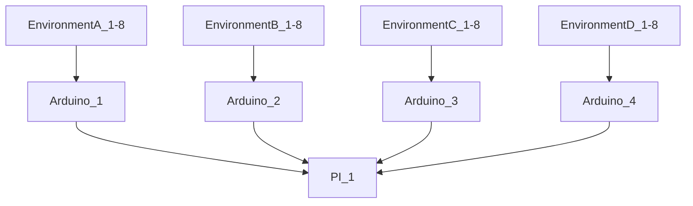

# Fung_OS

About Fung OS :  

Fung_OS is an open source embeded system to controll & monitor multiple enclosed mushroom cultivation envrionemnts for large scale production. 
Utilizing an ArduinoMEGA as the backend hardware controller and Rasbery PI 3B+ as the frontside user interface and system manager. 

The system is broken into two parts. The Arduino "Backend" and the PI "frontside". 

The Arduino is resposible for life support(s) managment and its attached environments that are supported by the life support sub system. 

The rasbery pi is responsible for the collection of data from the backend as well as providing an easy user interface to manage several systems and subsystems. 

## Arduino ( Backend )

The Arduino backend is witten in C++.  
Each Arduino can control 3 life supports.                  > ( envrionmental control hardware )
                                                          
Each life support can by default, support 4 environments   > ( fruiting chambers / tents / rooms )  

> **Note**
> 
> Environments are isolated Fruiting chambers or tents.

### life support:
Life support subsystem manages:

> 1. Lighting 
> 1. Heating 
> 1. Humidity/Air exchange
> 1. Water tank cleaning 
> 1. Waste pumps
> 1. Door/lighting bypass switch
> 1. Water level sensor
> 1. Valve system control 
    
    

## Rasbery PI

## System communication overview:

Basic example:

Arduino   <-- communication via USB -->  RasberyPI : ( user interface layer ) 

flow chart:

> **Note**

> **Warning**

 Click to expand 

  
1. hidden a
2. hidden b

