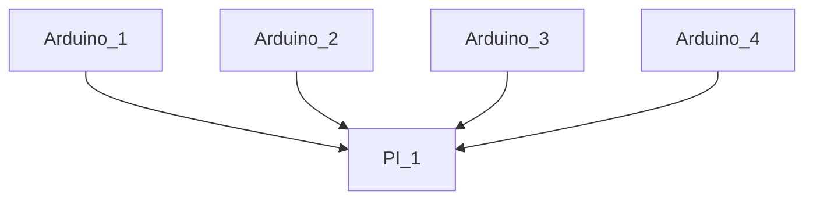

# Fung_OS

About Fung OS :  

Fung_OS is an embeded system to controll & monitor multiple enclosed mushroom cultivation envrionemnts. 
Utilizing an ArduinoMEGA as the backend hardware controller and Rasbery PI 3B+ as the frontside user interface and system manager. 

The system is broken into two parts. The Arduino "Backend" and the PI "frontside". 

Here is a simple flow chart:

Arduino   <-- communication via USB -->  RasberyPI : ( user interface layer ) 

> **Note**

> **Warning**

 Click to expand 

  
1. hidden a
2. hidden b

