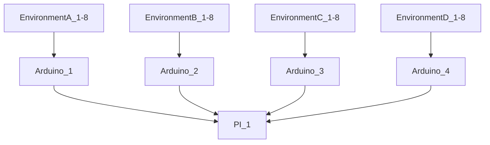
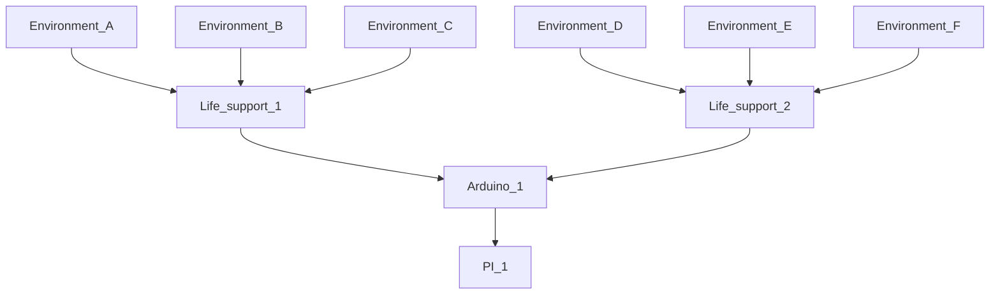

# Fung_OS

# About Fung_OS :  

Fung_OS is an open source embeded system to control & monitor multiple enclosed mushroom cultivation envrionemnts for large scale lab environments and production. 
Utilizing an ArduinoMEGA as the backend hardware controller and Rasbery PI 3B+ as the frontside user interface and system manager. 

The system is broken into two parts. The Arduino "Backend" and the PI "frontside". 

The Arduino is resposible for life support(s) managment and its attached environments that are controlled by the life support sub system. 

The Rasbery PI is responsible for the collection of data from the backend as well as providing an easy user interface to manage several systems and subsystems. 

## Arduino ( Backend )

> Definition: The Arduino( backend) is the hardware controller for life support subsystems and their connected environments...

The Arduino backend is witten in C++.  
Each Arduino can control 3 life supports.                  > ( envrionmental control hardware )
                                                          
Each life support can by default, support 4 environments   > ( fruiting chambers / tents / rooms )  

> **Note**
> 
> Environments are isolated Fruiting  [ Chambers / Tents / Rooms ] 

### life support:
Life support subsystem manages:

> 1. Lighting 
> 1. Heating 
> 1. Humidity/Air exchange
> 1. Water tank cleaning 
> 1. Waste pumps
> 1. Door/lighting bypass switch
> 1. Water level sensor
> 1. Valve system control 
    
  
## Rasbery PI

The rasbery pi frontside features:

> 1. User interface  
> 1. Full/Multi system control (multi Arduino communication)
> 1. Wifi - local network cluster communication
> 1. Data logging
> 1. Powerd by Pygame as rendering engine  
> 1. Multithreaded application 

## System communication overview:

Basic example:

Arduino   <-- communication via USB -->  RasberyPI : ( user interface layer ) 

flow chart:

## Life support sub_system overview:

Basic example: ( environments can be assigned to any life support ! )

life support (A) ---> FC_1, FC_2, FC_3

life support (B) ---> FC_4, FC_5

flow chart:

> **Note**

> **Warning**

 Click to expand 

  
1. hidden a
2. hidden b

