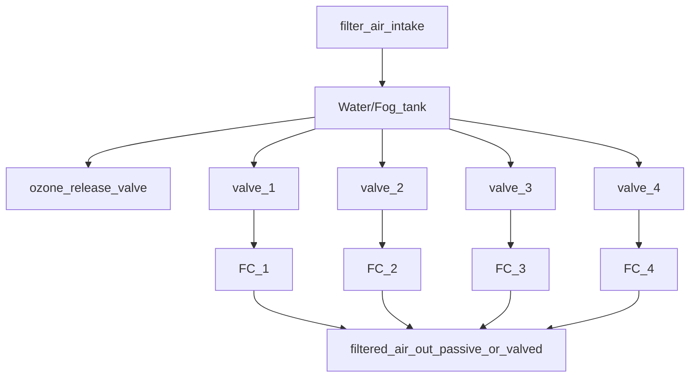

# Fung_OS

# About Fung_OS :  

Fung_OS is an open source embeded system to control & monitor multiple enclosed mushroom cultivation envrionments for lab environments and hobby / research applications. 

Utilizing an ArduinoMEGA as the backend hardware controller and Rasbery PI 3B+ as the frontside user interface and system manager. 

The system is broken into two parts. The Arduino "Backend" and the PI "frontside". 

The Arduino is resposible for life support(s) managment and its attached environments that are controlled by the life support sub system. 

The Rasbery PI is responsible for the collection of data from the backend as well as providing an easy user interface to manage several systems and subsystems. 

### Reason for creation: 
  > 1. Proof of concept frameworks
  > 1. Hardware & software experimentation
  > 1. Overall for personal learning
  > 1. Free to use for anyone in the mycology feild or as hobby equipment
  > 1. To fill a need for cheap hardware and simple software in the mycology feild / hobby.
  

## Arduino ( Backend )

> Definition: The Arduino( backend) is the hardware controller for life support subsystems and their connected environments...

The Arduino backend is witten in C++.  
Each Arduino can control 3 life supports.                  > ( envrionmental control hardware )
                                                          
Each life support can by default, support 4 environments   > ( fruiting chambers / tents / rooms )  

> **Note**
> 
> Environments are isolated Fruiting  [ Chambers / Tents / Rooms ] 

### life support:
Life support subsystem manages:

> 1. Lighting 
> 1. Heating 
> 1. Humidity/Air exchange
> 1. Water tank cleaning 
> 1. Waste pumps
> 1. Door/lighting bypass switch
> 1. Water level sensor
> 1. Valve system control 
    
  
## Rasbery PI

The rasbery pi frontside features:

> 1. User interface  
> 1. Full/Multi system control (multi Arduino communication)
> 1. Wifi - local network cluster communication
> 1. Data logging
> 1. Powerd by Pygame as rendering engine  
> 1. Multithreaded application 

## Multi Arduino communication

The Rasbery pi ( frontside user interface ) is able to communicate and manage 4 Arduinos at a time using a simple USB connection. No additional hardware required. 

Basic example:

Arduino   <-- communication via USB -->  RasberyPI : ( user interface layer ) 

flow chart:

## Life support:

Life support(s) are environent contollers. Life support subsystems are responsible for all aspects of the environemt core functions. 

8 pins are dedicated by default to manage core functions: 

> **Note** Core features by pin index: &#x1F536;

   ( Click to expand ) 

pin index: 

  > 1. Lighting
  > 2. air/humidity exhange
  > 3. Waste water collection pumps
  > 4. Tank cleaning ( ozone scrubber )
  > 5. Heating
  > 6. Ozone gas release valve
  > 7. Water tank level sensor 
  > 8. Door/light override toggle button     

Each life support subsystem that is created has a large number of settings to maintain its function. These settings can be changed via serial communication via commands through the front end interface. 
> **Warning** manually setting from source: see ending for headless running [ no pi needed ! ] ) 

## Environments: 

Basic example: ( environments can be assigned to any life support ! )

life support (A) ---> FC_1, FC_2, FC_3

life support (B) ---> FC_4, FC_5

flow chart:

## Building a system: 

flow chart: [ single life support air routing ] 

> **Note**

> **Warning**

 Click to expand 

  
1. hidden a
2. hidden b

